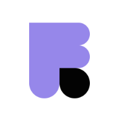
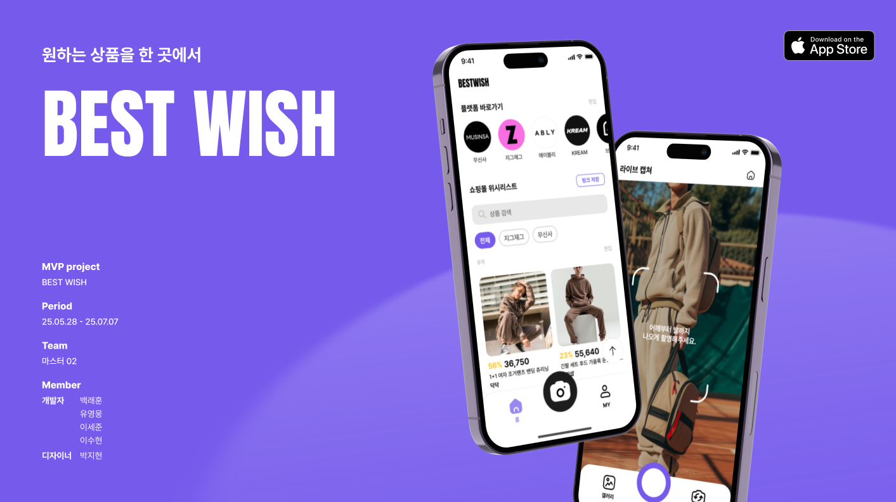
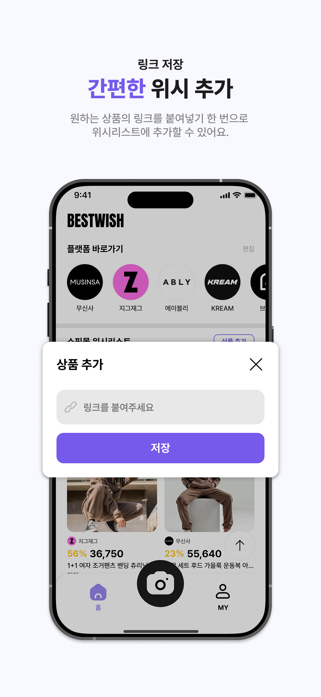
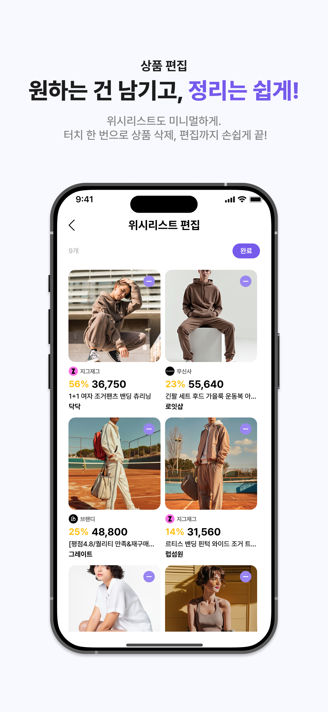
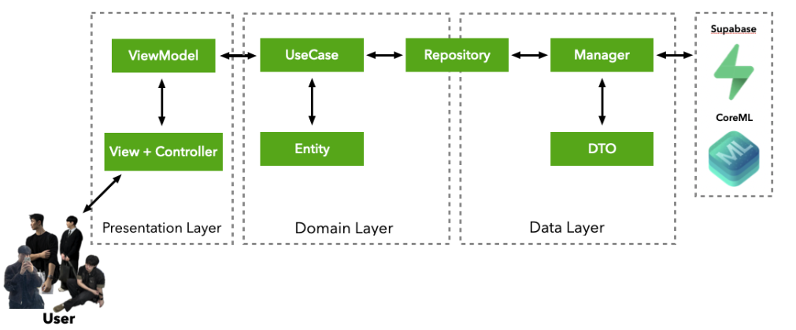
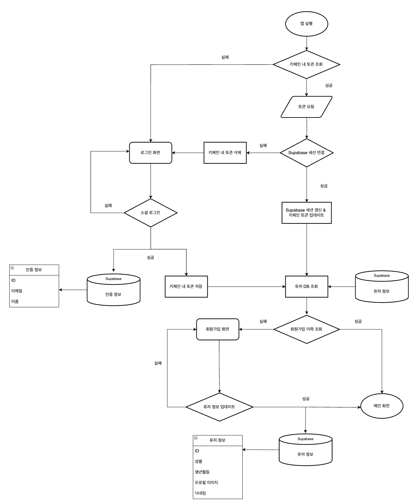
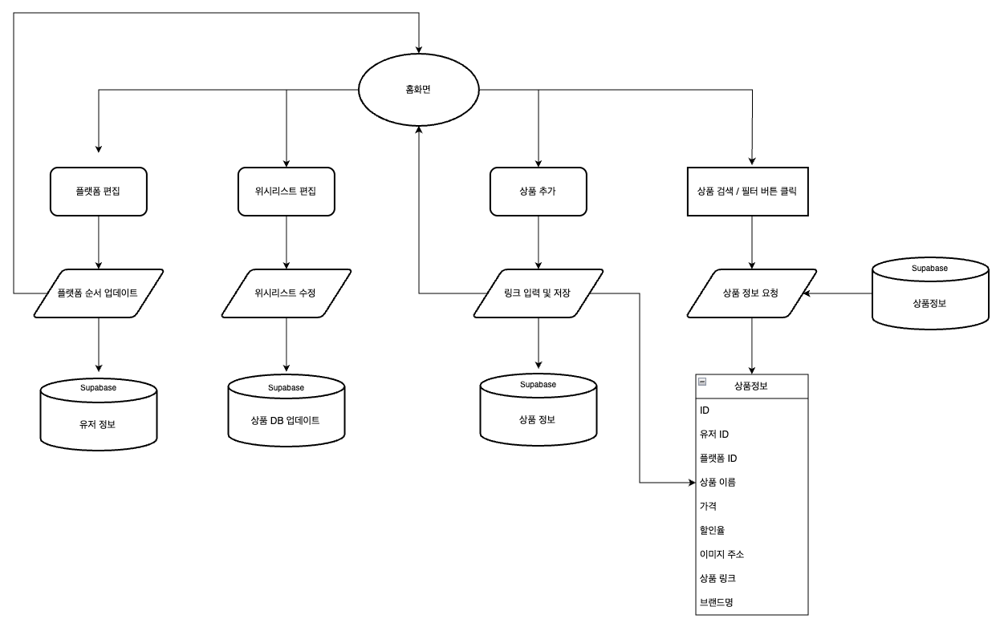
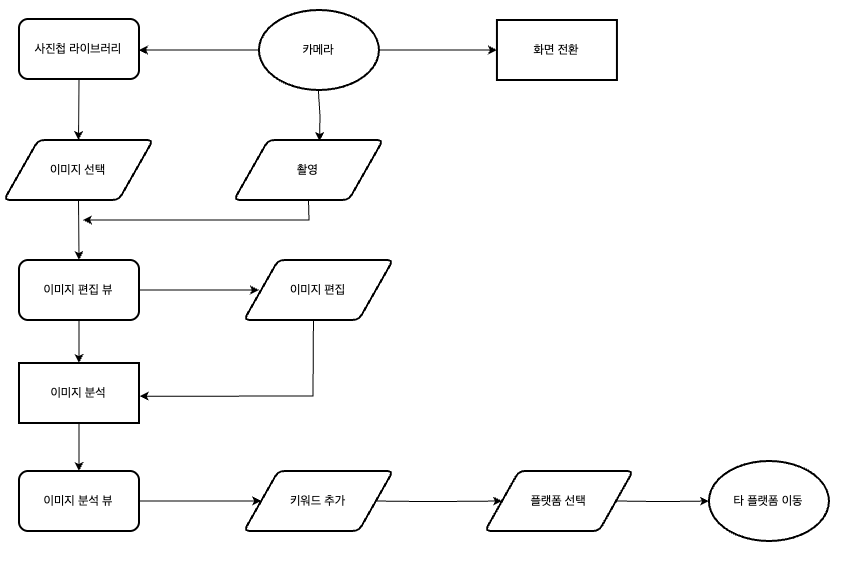
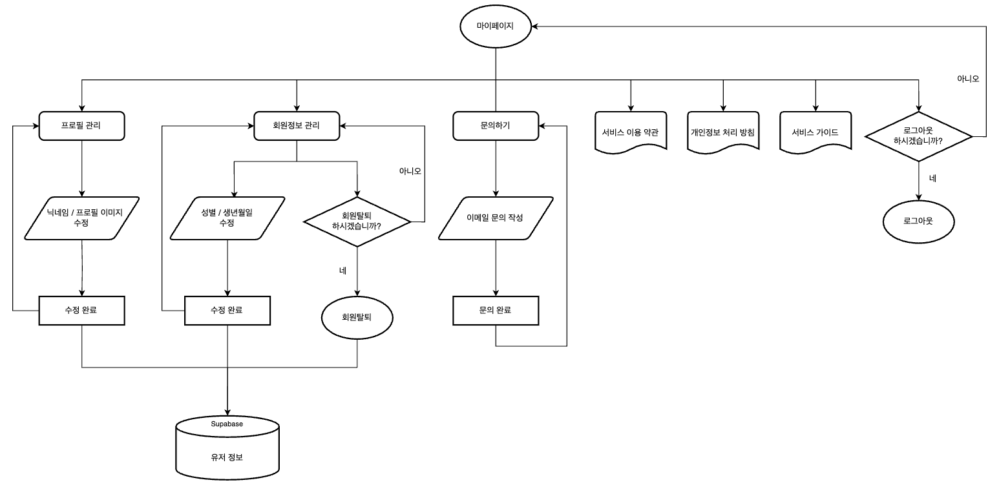

# BEST WISH  
### 다양한 쇼핑 플랫폼의 위시리스트를 통합 관리 서비스



> 바로가기 

 <!-- 방법 1: p 태그의 align 속성 사용 -->
<a href="https://apps.apple.com/kr/app/bestwish/id6747424430">
    
  </a>
  <a href="https://linktr.ee/bestwish___official">
    
  </a>
  <a href="https://www.instagram.com/bestwish___official">
    
  </a>
    <a href="mailto:bycompany02@gmail.com">
    
  </a>


---- 

## Introduce
> 서비스 이름

**BestWish**

> 개발 기간

2025.05.29 ~

## Contents
- **분산된 위시리스트 통합**: 다양한 쇼핑 플랫폼의 상품 정보를 하나의 앱에서 관리할 수 있도록 지원합니다.
- **이미지 기반 정보 추출 및 키워드화**: CoreML을 통해 코디 이미지에서 키워드를 자동으로 추출하고, 이를 활용해 외부 플랫폼에서 상품 검색까지 가능합니다.
- 분석과 검색, 저장까지 연결된 **개인화된 쇼핑 어시스턴트**를 지향합니다.


## MVP
<table>
  <tr>
    <td></td>
    <td></td>
    <td></td>
  </tr>
  <tr>
    <td></td>
    <td></td>
    <td></td>
  </tr>
</table>

## Developers
| |  |  |  | 
|:-----:|:-----:|:-----:|:-----:|
|[백래훈](https://github.com/RaeBaek)|[유영웅](https://github.com/QuaRang1225)|[이수현](https://github.com/LeeeeSuHyeon)|[이세준](https://github.com/Yimkeul)|
|리더 👑|부리더 👑|팀원 👨🏻‍💻|팀원 👨🏻‍💻|
|`홈 화면 구현`<br/>`딥링크 활용한 플랫폼 간 연결`<br/>`Share Extension을 활용한 상품 저장 구현`<br/>|`CoreML 활용 이미지 분석 기능`<br/>`패션 캡처 화면 구현`<br/>`커스텀 탭바 및 카메라 구현`<br/>|`공통 컴포넌트 구현`<br/>`마이페이지 구현`<br/>`Supabase 구조 및 네트워크 로직 구현`<br/> | `소셜 로그인 OAuth 구현`<br/>`로그인 토큰 암호화 관리`<br/>`회원가입 온보딩 화면 구현`<br/> 
</div>
<br/>


## Architecture



## Skills
| Name          | Description   |
| ------------  | ------------- |
| **UIKit** | iOS 앱의 UI를 구축하고 사용자 인터페이스를 관리하는 기본 프레임워크 |
| **SnapKit** | Auto Layout 제약 조건을 간결하게 선언하여 코드의 가독성과 유지보수성을 높이기 위해 사용|
| **Then** | UI 컴포넌트를 선언형 스타일로 초기화 목적으로 사용|
| **Kingfisher** | 네트워크 이미지 로드 및 캐싱 자동화 목적으로 사용|
| **Alamofire** | 네트워크 요청을 간결하고 효율적으로 처리 목적으로 사용|
| **RxSwift** | 비동기 이벤트 흐름을 선언적으로 처리하고 다양한 Operator로 반응형 프로그래밍 구현을 위해 사용 |
| **RxDataSources** | Rx 기반으로 테이블/컬렉션 뷰 섹션 데이터 바인딩 목적으로 사용 |
| **IQKeyboardManager** | 키보드 등장 시 UI 자동 정렬 및 흐름 제어 목적으로 사용|
| **TOCropViewController** | 비동기이미지 자르기 등 편집 기능 목적으로 사용 |
| **Supabase** | 백엔드 없이 인증 및 데이터베이스 기능 구현 목적으로 사용|

## Convention
<details>
  <summary><strong>Commit Convention</strong></summary>

```
setting: 프로젝트 초기 세팅
feat: 새로운 기능 구현
fix: 기존 기능 개선, 코드 수정 (피드백 반영 등) UI는 fix
bugfix: 버그, 오류 해결
hotfix: 릴리즈, 메인에서 발견된 치명적 오류 해결
test: 테스트 코드 작성
refactor: 프로덕션 코드 리팩토링 (구조 변경, 성능 개선)
chore: 빌드 테스트 업데이트, 패키지 매니저를 설정하는 경우(프로덕션 코드 변경 X)
docs: README나 WIKI 등의 문서 개정


comment: 필요한 주석 추가 및 변경
design: 오로지 화면.레이아웃 조정
rename:	파일 혹은 폴더명을 수정하거나 옮기는 작업만인 경우
remove:	파일을 삭제하는 작업만 수행한 경우

-------------------------------------

ex)
feat: #(이슈번호) - (해당 작업에 대한 내용)
merge: #(해당이슈) - Commit Merge
```
</details>
<details>
  <summary><strong>Branch Convention</strong></summary>
  
#### 브랜치 구조

- `main`
    - 운영 배포용 브랜치 (항상 안정 상태 유지)
    - 실제 배포 시 `main`에 머지하고 태그 버전(`v1.0.0`) 생성
- `develop`
    - 기본 브랜치 (default)
    - 개발 중인 기능들을 통합하고 QA 테스트 용으로 사용
- 기타 브랜치 종류:

| 브랜치 타입 | 용도 | 예시 |
| --- | --- | --- |
| `feature/*` | 신규 기능 개발 | `feature/login-api` |
| `fix/*` | 버그 수정 | `fix/image-cache-bug` |
| `refactor/*` | 리팩토링 | `refactor/homeview-layout` |
| `hotfix/*` | 운영 중 긴급 수정 | `hotfix/token-refresh-failure` |
| `release/*` | 배포 준비 및 QA 대응 | `release/v1.2.0` |

---

**브랜치 네이밍 규칙**

- 모두 소문자 사용
- 띄어쓰기는 하이픈()으로 연결
- 접두어는 작업 성격에 따라 구분 (`feature/`, `fix/`, 등)
- 이슈번호로 브랜치 생성시 다음과 같이 생성
```
feature/#{이슈번호}-home-ui 

ex) feature/#4-home-ui
```
</details>

## Demonstration
<table>
  <tr>
    <td align="center">온보딩</td>
    <td align="center">플랫폼 바로가기</td>
    <td align="center">Share Extension</td>
    <td align="center">위시리스트</td>
    <td align="center">이미지 분석 및 키워드 추출</td>
    <td align="center">마이페이지</td>
  </tr>
  <tr>
    <td></td>
    <td></td>
    <td></td>
    <td></td>
    <td></td>
    <td></td>
  </tr>
</table>

## Flow Chart

|로직|플로우차트|
|:---:|:---:|
|인증||
|홈 ||
|이미지 분석||
|마이페이지||


## TroubleShoting
백래훈
- [Share Extension - Keychain Sharing 문제를 해결하다!](https://rb-ios.tistory.com/21)
- [UIButton 가변 너비 & 줄바꿈 문제: titleLineBreakMode로 해결!](https://rb-ios.tistory.com/20)

유영웅
- [카메라가 계속 켜진다..? 세션과 생명주기를 알아보자!](https://quarang.tistory.com/110)
- [아니 Rx를 쓰면 무한루프가 따라온다고 ㅋㅋ 무한루프 방지하기](https://quarang.tistory.com/111)
- ["인간시대 끝이 도래했다" - CoreML](https://quarang.tistory.com/112)
- [이거 이렇게 자동화 하는거 아닌데~ - CI/CD 관련](https://quarang.tistory.com/113)

이수현
- [Clean Architecture 구조에서의 Error 설계에 대한 고찰](https://soo-hyn.tistory.com/153)

이세준
- [IQKeyboardManager 사용 중 실기기 UI 오류 해결](https://buly.kr/7QMM3rN)
- [Supabase Auth](https://velog.io/@yimkeul/Supabase-Auth)
- [소셜 로그인 관련 메모리 누수 해결](https://buly.kr/jZYms2)

## Usage
```
git clone https://github.com/back-young-company/project-bestwish.git
cd BestWish
open BestWish.xcodeproj
# 실행: ⌘ + R 
``` 


## Contact
mail : bycompany02@gmail.com
